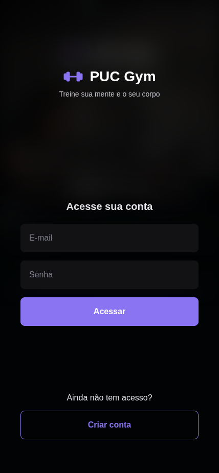
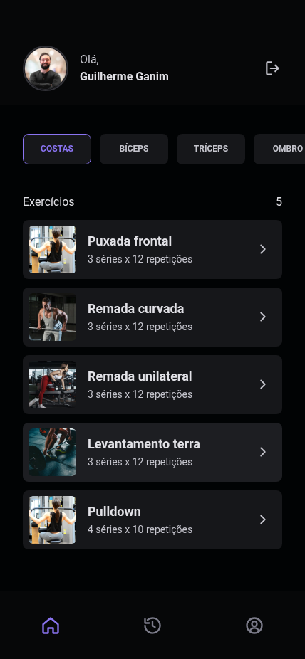
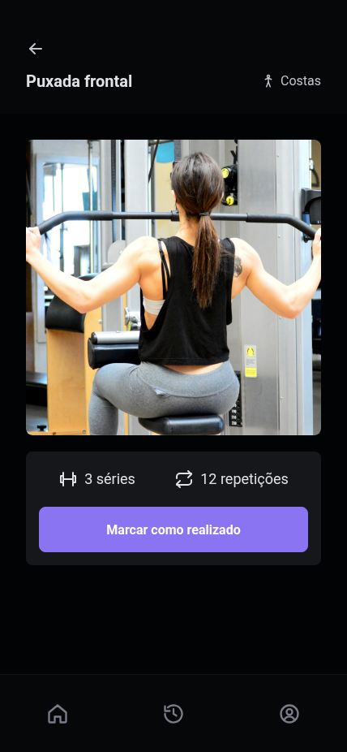

# SiGAT – Sistema de Gestão e Acompanhamento de Treinos (PUC Gym)

Projeto Integrador II-B — Tecnologia em Análise e Desenvolvimento de Sistemas — PUC Goiás, 2026
Prof. José Ricardo Cosme Lérias Ribeiro, MSc

## Equipe
- Guilherme Rezende Ganim
- José Augusto Soares de Moura

## Sobre
Especificação de requisitos de um sistema cliente/servidor para academias de pequeno porte: o
aluno consulta os exercícios por grupo muscular, vê a demonstração da execução, marca o que
realizou e acompanha o histórico; o instrutor mantém o catálogo e acompanha a frequência.

O trabalho cobre a etapa de engenharia de requisitos — levantamento com usuários reais,
requisitos funcionais e não funcionais, casos de uso, protótipo de alta fidelidade e validação —
e traz, como complemento, uma implementação de referência do aplicativo em React e da API em
Node.js.

## Artefatos
| Artefato | Onde |
|---|---|
| Documento de requisitos (PDF) | [`documento/SiGAT-Documento-de-Requisitos.pdf`](documento/SiGAT-Documento-de-Requisitos.pdf) |
| Fonte do documento (HTML + CSS + script de geração) | [`documento/`](documento/) |
| Diagrama de casos de uso | [`documento/assets/casos-de-uso.png`](documento/assets/casos-de-uso.png) (fonte SVG ao lado) |
| Telas do protótipo | [`documento/assets/telas/`](documento/assets/telas/) |
| Protótipo interativo | [Figma – Projeto Integrador II-B](https://www.figma.com/design/XsmNzKUL08eEDuwVclCDK6/Projeto-Integrador-II-B) |
| Implementação de referência (React + Node) | [`puc-gym/`](puc-gym/) — instruções de execução no README da pasta |
| Apresentação (5 min) | _link do vídeo_ |

## Estrutura do documento
1. Introdução · 2. Informações do cliente · 3. Levantamento de requisitos · 4. Características do
sistema (RF e RNF) · 5. Restrições e premissas · 6. Casos de uso · 7. Protótipo · 8. Validação com
os usuários · 9. Matriz de rastreabilidade · 10. Sustentabilidade · 11. Glossário · 12. Conclusão ·
Anexo A – Entrevistas

## Telas do aplicativo em execução
| Login | Home | Exercício |
|---|---|---|
|  |  |  |
