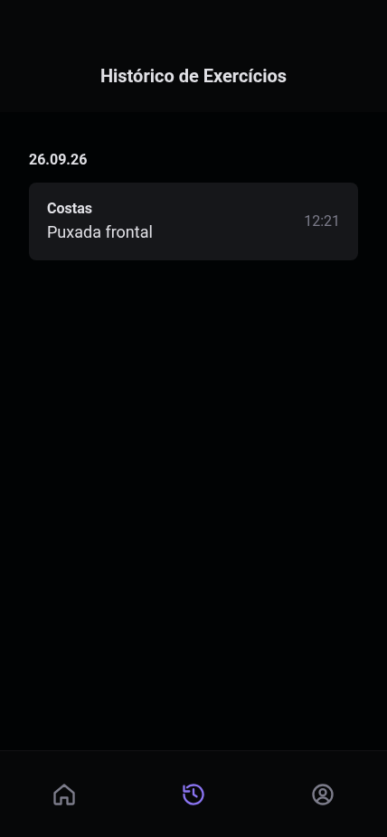
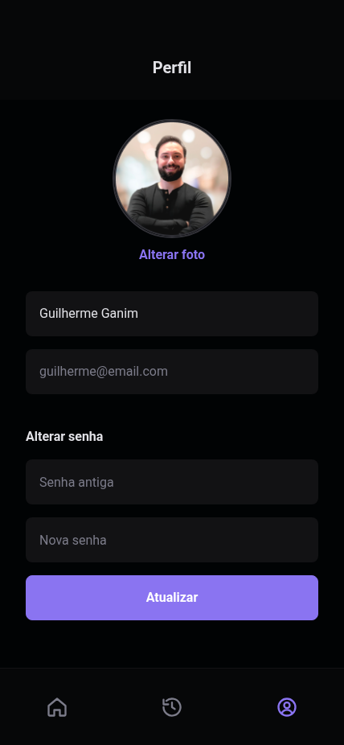
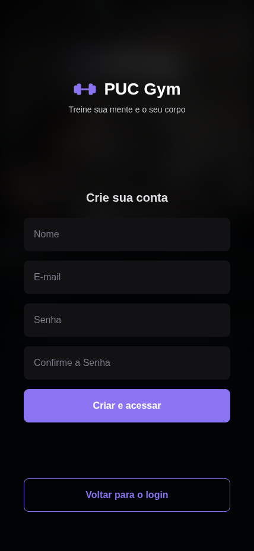

# PUC Gym — SiGAT (Sistema de Gestão e Acompanhamento de Treinos)

Implementação de referência do sistema especificado no Projeto Integrador II-B (PUC Goiás, ADS, 2026).
Arquitetura cliente/servidor: aplicativo em React (mobile-first) consumindo uma API REST em Node.js.

Equipe: Guilherme Rezende Ganim e José Augusto Soares de Moura.

## Estrutura

| Pasta | O que é |
|---|---|
| `web/` | Cliente React + Vite + TypeScript — telas Login, Cadastro, Home, Exercício, Histórico e Perfil |
| `server/` | API Express + TypeScript — autenticação JWT, catálogo, histórico e frequência |
| `docs/screenshots/` | Telas do aplicativo em execução |

## Como rodar

Requisito: Node.js 20 ou superior.

Terminal 1 — servidor (porta 3333):

```bash
cd server
npm install
npm run dev
```

Terminal 2 — cliente (porta 5173):

```bash
cd web
npm install
npm run dev
```

Abra `http://localhost:5173`. O Vite encaminha as chamadas `/api` para o servidor.

Na primeira execução o servidor cria `server/data/db.json` com o catálogo de exercícios e duas
contas de teste (aluno e instrutor). Os dados ficam em `server/src/db.ts`; para voltar ao estado
inicial, apague `server/data/db.json` e reinicie o servidor.

## Contas de teste

| Perfil | E-mail | Senha |
|---|---|---|
| Aluno | guilherme@email.com | 12345678 |
| Instrutor | instrutor@pucgym.com | 12345678 |

Novas contas de aluno podem ser criadas pela tela "Criar conta".

## API

Todas as rotas abaixo de `/api`. As marcadas com 🔒 exigem `Authorization: Bearer <token>`.

| Método | Rota | Descrição | RF |
|---|---|---|---|
| POST | `/users` | Criar conta de aluno | RF01 |
| POST | `/sessions` | Login (retorna token JWT) | RF02 |
| GET | `/me` 🔒 | Dados do usuário logado | RF02 |
| PUT | `/me` 🔒 | Alterar nome e foto | RF08 |
| PUT | `/me/password` 🔒 | Alterar senha | RF09 |
| GET | `/groups` 🔒 | Grupos musculares | RF03 |
| GET | `/exercises?group=` 🔒 | Exercícios do grupo | RF04 |
| GET | `/exercises/:id` 🔒 | Detalhe do exercício | RF05 |
| POST | `/history` 🔒 | Marcar exercício como realizado | RF06 |
| GET | `/history` 🔒 | Histórico agrupado por dia | RF07 |
| POST/PUT/DELETE | `/exercises` 🔒 instrutor | Manter catálogo | RF11 |
| GET | `/frequency` 🔒 instrutor | Frequência dos alunos | RF12 |

## Scripts

| Pasta | Comando | Faz |
|---|---|---|
| `server` | `npm run dev` | Sobe a API com recarga automática |
| `server` | `npm run build` / `npm start` | Compila e roda a versão final |
| `web` | `npm run dev` | Sobe o cliente em desenvolvimento |
| `web` | `npm run build` | Checa tipos e gera a versão final em `web/dist` |

## Telas

| Login | Home | Exercício |
|---|---|---|
|  |  |  |

| Histórico | Perfil | Cadastro |
|---|---|---|
|  |  |  |

## Documentação

O documento de requisitos, o diagrama de casos de uso e o protótipo no Figma estão na pasta
`documento/` deste repositório e em
[figma.com/design/XsmNzKUL08eEDuwVclCDK6](https://www.figma.com/design/XsmNzKUL08eEDuwVclCDK6/Projeto-Integrador-II-B).
